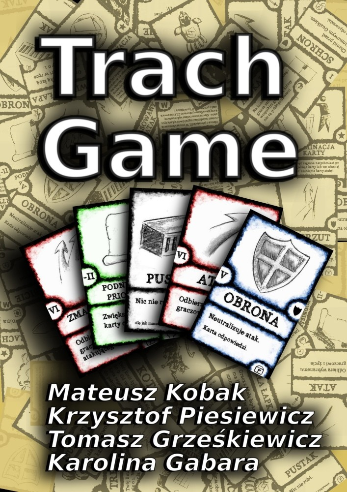
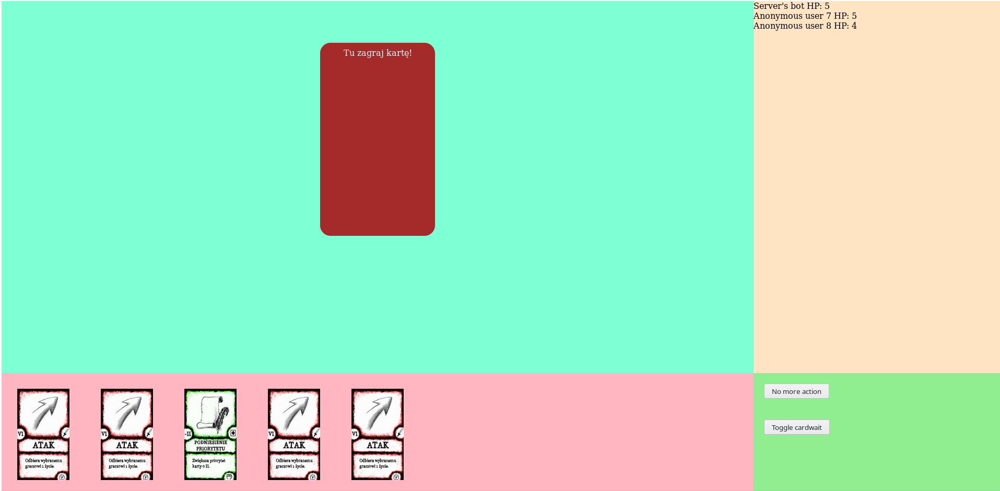
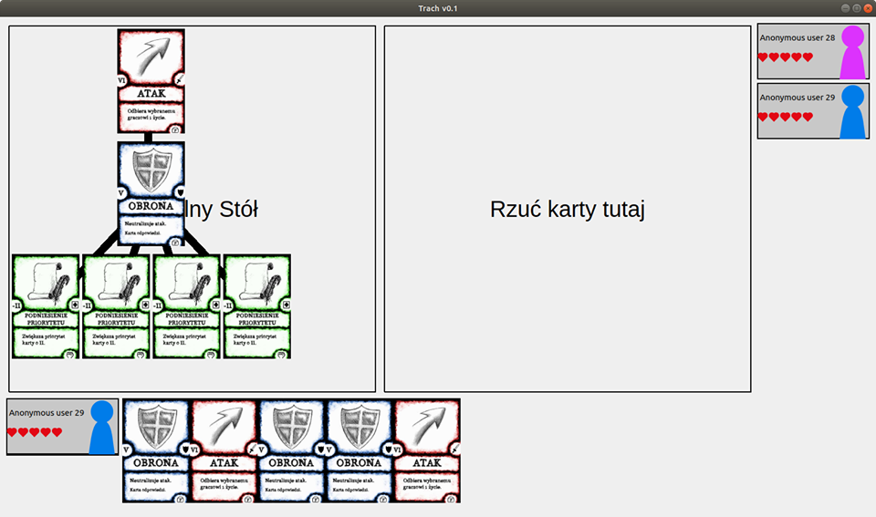

# trach-scala-IO2018L
Multiplayer card game with bots based on an existing card game. System designed and partially implemented as a team project in Software Engineering course at MIMUW in 2019. https://youtu.be/yfCIdyFDM8w

<table>
  <tr>
    <td>
      
    </td>
    <td>
      
      
    </td>
  </tr>
</table>

# Documents in Polish
- [Project description](doc/Trach%20Game.pdf)
- [Game rules](doc/Trach.%20Zasady%20gry.%20Podstawka.pdf)
- [Functional requirements](doc/Wymagania%20funkcjonalne.pdf)
- [Use cases](doc/Przypadki%20użycia.pdf)
- [Non-functional requirements](doc/Wymagania%20niefunkcjonalne.pdf)
- [GUI description](doc/Opis%20GUI.pdf) (graphics: [gui.png](doc/gui.png))
- [Technical specifications](doc/Specyfikacja%20techniczna.pdf)
- [System models and protocols](doc/Modele%20i%20komunikacja.pdf)
- [Test plan](doc/Testowanie.pdf)
- [Plan of 2nd iteration](doc/Trach%20Game%20-%202.%20iteracja.pdf)
